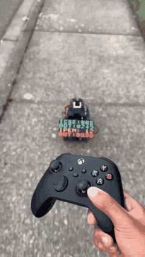

# SidewalkPilot

SidewalkPilot is a self-driving RC car for **sidewalks**. A convolutional neural network steers a real, car-sized RC vehicle down residential sidewalks — with LiDAR emergency braking, GPS route-following, and a live LED dashboard. Built from scratch with a Raspberry Pi 5, Zero 2 W, and an NVIDIA Jetson Orin Nano.

<table width="100%">
<tr>
<td valign="top" align="left">

- [YouTube](https://www.youtube.com/@SidewalkPilot)
- [Docs](https://ramcodesbetter.github.io/SidewalkPilot/)
- [Hugging Face](https://huggingface.co/ram-shreyas-naik-sabavat)
- [GitHub](https://github.com/RamCodesBetter/SidewalkPilot)
- [Parts List](https://1drv.ms/x/c/9685d41907cf4e28/IQAZPTqPm5FDRLypIrzf-Jv5AapVDVfyFpqjfn2W666oeXk?e=3MadEB)
- [Twitter](https://x.com/SidewalkPilot)
- [Grafana Labs](Adding Later...)
- [Weights and Biases](Adding Later...)
- [Email](mailto:ramsabavat2012@gmail.com)

</td>
<td valign="top" align="right">

</td>
</tr>
</table>

> Independent research/learning project, run on private test routes. This car is not a road-legal autonomous vehicle.

## How it works

Three *manager* computers control the entire RC car. The **Raspberry Pi 5 (RPI5)** reads every sensor and drives the hardware. It streams camera frames to the **Jetson Orin Nano (JON)**, which runs the neural network and sends back a steering angle + throttle. The RPI5 then **fuses** that with LiDAR safety and GPS navigation before moving the wheels — and mirrors everything to a **Raspberry Pi Zero 2 W (Z2W)** LED dashboard. All the sensors feed data to the RPI5, the JON does the thinking, and the RPI5 sends commands to the motors and steering, with me always able to take over or kill the run.

## Hardware

| Role | Component |
|---|---|
| **Major System Manager (RPI5)** | Raspberry Pi 5 (8 GB) — main controller: sensors, motors, steering, logging |
| **AI Model Manager (JON)** | NVIDIA Jetson Orin Nano — runs the steering neural network (ONNX / TensorRT) |
| **Display System Manager (Z2W)** | Raspberry Pi Zero 2 W — LED dashboard over USB |
| Vision | Raspberry Pi Camera Module 3 Wide |
| Obstacles | Youyeetoo FHL-LD19 360° LiDAR — emergency braking + avoidance |
| Navigation | BN880 GPS + HMC5883L compass |
| Speed | Hall-effect sensor |
| Chassis | Yahboom Ackermann 520M — real car-style steering |
| Steering | PCA9685 PWM driver → steering servo |
| Drive | Yahboom AT8236 motor controller → DC motors |
| Manual control | Xbox Wireless Controller — drive + safety kill switch |
| Dashboard | Waveshare 64×32 RGB LED matrix (HUB75) + MAX7219 8×32 |
| Power | INIU power banks (140 W for JON, 45 W for RPI5/Z2W); OVONIC 3S LiPo (motors) + 2S LiPo (display); buck converters + fuses |

## The model

The brain is a convolutional neural network trained on tens of thousands of real sidewalk frames. It has grown through three generations:

- **Series 1 — the foundation.** A small (~2.7 M-parameter) network that predicts a steering angle directly from the image (200×66 input). It proved my car could follow a sidewalk from camera alone, and established the image → steering-label training pipeline.
- **Series 2 — refinement.** Same direct-steering design, cleaner data, and tuned steering range. Added an HSV + CLAHE contrast option (models 2.0/2.0b) to fight harsh lighting — kept as a tool, not the default.
- **Series 3 — the current generation.** A larger (~5.5 M-parameter) network with a **hybrid head**: it first classifies a coarse steering direction, then regresses the exact angle within it (plus throttle), on a 320×180 image with shadow/lighting augmentation. Series 3 was *originally targeted for quantization* (FP32 → FP16 → INT8 / TensorRT) to squeeze a heavy model onto the Jetson — but the focus **shifted toward accuracy and robustness**: the hybrid head and shadow-hardened training, running directly on the Jetson Orin Nano. The camera runs at 30 fps and the model runs at 30 ips (inferences per second) so there is no need to quantize the model.

Current best model **v3.2b** predicts steering to ~14° mean error on held-out validation. A full per-model breakdown is available in [`docs/steering_model_report.pdf`](docs/steering_model_report.pdf).

### Why the buckets matter — bright sidewalk vs. dark shadows

The hardest real-world case is a bright sidewalk cut by sharp tree-shadows. A model that predicts a single raw steering number tends to **follow the shadow's diagonal edge**, mistaking it for the edge of the path. The hybrid head fixes this by outputting a **probability for each steering direction — left, right, or straight — instead of one number.** Reading those probabilities, the car can tell "I'm genuinely turning" apart from "I'm confidently straight, just crossing a shadow line," and commit to driving *straight through* the shadow instead of being pulled off course. That, together with shadow-hardened training data, is how Series 3 attacks the bright/dark problem.

## Training & testing

**Data:** Every field run logs camera frames paired with the human's steering and throttle, building a dataset of tens of thousands of real sidewalk images (published on [Hugging Face](https://huggingface.co/ram-shreyas-naik-sabavat)).

**Training:** All my models are trained on an NVIDIA RTX 6000 Ada-generation GPU. Each image is augmented on the fly — brightness/HSV jitter and **synthetic diagonal shadow bands** that mimic bright-sun-through-trees lighting — so the model practices on hard shadows it would otherwise rarely see. The photos come from real driving, so frames right next to each other look almost identical. If the model studied some frames and then got "tested" on their near-twins, it would pass validation just by memorizing. To stop that, the trainer splits the data by time: each drive is chopped into short chunks, and every 10th chunk is locked away as a test the model never trains on. Now its validation score is honest and it has to handle stretches of sidewalk it's genuinely never seen.

**Testing:** A held-out validation set scores steering error, bucket accuracy, and the predicted-vs-actual direction spread every epoch. A separate evaluator then runs *every* model over the full dataset and generates a per-model PDF report — mean/median error, "within N degrees," and a **bucket confusion matrix** — a grid of which steering directions the model mixes up ([full report](docs/steering_model_report.pdf)). Finally the real car is **field-tested** on sidewalks across day (2:00–6:30 pm), night (9:00–10:00 pm), and shadow conditions (11:00 am–1:00 pm); runs in these times are where failures like shadow-following get caught and fed back into the next dataset.

## Repo layout

| Path | Contents |
|---|---|
| `code/controller/current/` | Live runtime — RPI5 controller, JON inference server, Z2W dashboard |
| `code/ai_models_datasets/` | Training code + datasets (Series 1/2/3) |
| `code/ai_models/` | Trained model checkpoints |
| `code/test_files/` | Bench + calibration utilities |
| `docs/` | Model cards, evaluation report, MkDocs source |
| `trossachs_navigation_app/` | Companion iOS navigation app |

## License

Apache 2.0 — see [LICENSE](LICENSE).
