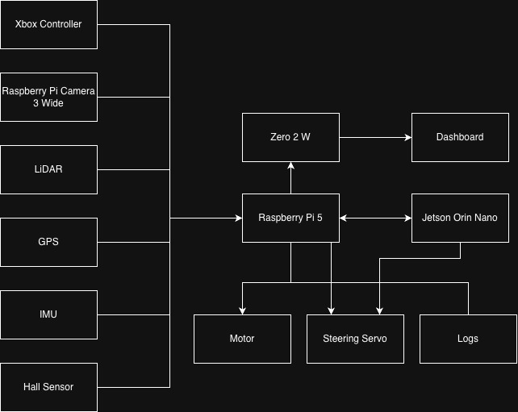

# SidewalkPilot

SidewalkPilot is my RC car that can self-drive on sidewalks. The Jetson Orin Nano is the
AI brain for the current Series 3/4 autonomy system: it runs the camera-steering model and
returns the steering prediction. A Raspberry Pi 5 captures the camera and sensors, applies
safety rules, and controls the hardware, while a Zero 2 W renders the live LED dashboard.

<table width="100%">
<tr>
<td valign="top" align="left">

- [Documentation](https://ramcodesbetter.github.io/SidewalkPilot/)
- [YouTube](https://www.youtube.com/@SidewalkPilot)
- [Hugging Face](https://huggingface.co/ram-shreyas-naik-sabavat)
- [Parts list](https://1drv.ms/x/c/9685d41907cf4e28/IQAZPTqPm5FDRLypIrzf-Jv5AapVDVfyFpqjfn2W666oeXk?e=3MadEB)
- [Twitter](https://x.com/SidewalkPilot)
- [Email](mailto:ramsabavat2012@gmail.com)

</td>
<td valign="top" align="right">

</td>
</tr>
</table>

> SidewalkPilot is a supervised research and learning project used on controlled test routes with the operator present. It is not certified or approved for unattended or public-road operation.

## Current Result

**SidewalkPilot v3.4** is the current field-selected steering model. During the July 13th, 2026 comparison, v3.4 handled every shadow case presented and the tested normal left/right turns. v3.4b was slightly worse, v3.3 was worse than v3.2, and v3.3b was much worse than v3.2b. The observation is valuable but qualitative because route, clip, weather, and takeover metadata were not preserved.

I have currently been working on Series 3 and Series 4 in parallel on the same 81,237-image Series 3/4 dataset. v4.0 is an experimental version where I test different inputs and ways to train my model. After field-testing these models, 4.1 onwards will be built with one of the three architectures below (I will continue to work on Series 3 in parallel):

| Experiment | Final epoch | Best steering-MAE epoch | Runtime contract |
|---|---|---|---|
| Previous + current (PC) | v4.0p | v4.0r | image + three prior steering targets -> current steering |
| Current + future (CF) | v4.0f | v4.0g | image -> current plus three future steering horizons |
| Previous + current + future (PCF) | v4.0a | v4.0c | image + three prior targets -> current plus three future horizons |

All six Series 4 ONNX models are supported by the live Jetson Orin Nano runtime. None has been field-tested yet, so v3.4 remains the best tested model.

## System Architecture

The three computers have separate responsibilities:

| Manager | Hardware | Responsibility |
|---|---|---|
| AI Model Manager | Jetson Orin Nano | Receives the newest camera frame over dedicated Ethernet and runs Series 3/4 ONNX Runtime/CUDA inference |
| Hardware and Safety Controller | Raspberry Pi 5 | Controller input, camera capture, LiDAR, GPS, steering, motors, logging, and final safety arbitration |
| Display Controller | Zero 2 W | Renders the Waveshare 64x32 HUB75 dashboard from UDP telemetry over a dedicated USB network |

The Jetson Orin Nano is essential to the current v3.4 and Series 4 self-driving path. Those
larger 320x180 models run too slowly on the Raspberry Pi 5 CPU for the selected live
deployment, while the Jetson Orin Nano GPU runs them near the camera rate. If no fresh
Jetson Orin Nano prediction is available, current autonomy stops. The Raspberry Pi 5 remains
the hardware and safety controller, so the Jetson Orin Nano never writes the servo or motors directly.
Manual driving and the legacy Series 1/2 local-model path can still operate without it.

The Jetson Orin Nano analyzes camera images in a background thread so the Raspberry Pi 5 can continue reading the controller and operating the car. LiDAR works as a separate braking system: it can slow or stop the car when an obstacle is directly ahead, but it does not swerve around the obstacle.

## Model Journey

SidewalkPilot has 46 trained steering checkpoints across four series:

- **Series 1:** compact 200x66 direct steering regression established the end-to-end image-to-servo loop.
- **Series 2:** retained the approximately 0.67M-parameter model while testing data cleanup, steering range, and HSV/CLAHE preprocessing.
- **Series 3:** moved to 320x180 images and an approximately 5.53M-parameter network. v3.1+ uses nine steering-class logits, nine class-local offsets, and one throttle output.
- **Series 4:** keeps the Series 3 visual backbone, removes throttle learning, and compares causal steering history and multi-horizon supervision. PC, CF, and PCF contain approximately 5.54M to 5.57M parameters.

The generated [steering-model report](docs/steering_model_report.pdf) evaluates all 46 models on the same frozen 6,952-frame challenge subset. Selection does not rely on MAE alone. The report includes balanced nine-class recall (Bal9), exact and adjacent turn recall, straight recall, median error, signed bias, and confusion matrices.

## Data and Training

Field runs record camera images paired with logical steering degrees (`0..180`) and absolute physical throttle (`0..1`). Series 3 and 4 share a 81,237-image real-world dataset. The trainer sorts images by path and groups them into 100-frame windows. Each window goes entirely into training or validation, which keeps most neighboring frames together. One capture run can still appear in both sets.

Training runs on an NVIDIA RTX 6000 Ada-Generation GPU. The Series 3/4 trainers support lighting, color, flip, and synthetic-shadow augmentation. The trainer saves and exports the final-epoch and the best-steering-MAE artifacts as ONNX, and logs to Weights & Biases. Physical field testing remains the deciding factor after offline evaluation.

## Hardware

| Function | Component |
|---|---|
| AI Model Manager | Jetson Orin Nano |
| Hardware and safety controller | Raspberry Pi 5 |
| Display controller | Zero 2 W |
| Chassis | Yahboom Ackermann 520M |
| Camera | Raspberry Pi Camera Module 3 Wide |
| Obstacle Detection (AEB) | Youyeetoo FHL-LD19 360-degree LiDAR through a CP2102 UART-to-USB Adapter |
| Steering | PCA9685 Servo Controller and 25KG steering servo |
| Drive | Yahboom AT8236 Motor Controller and JGB37-520 DC motors (12 V, 550 RPM) |
| Navigation | BN880 GPS; onboard HMC5883L compass is bench-only (not used during runtime) |
| Motion feedback | Hall-effect wheel-speed sensor and external IMU |
| Manual control | Xbox Wireless Controller |
| Dashboard | Waveshare 64x32 HUB75 RGB LED matrix |

## Repository Map

| Path | Contents |
|---|---|
| `code/controller/current/` | Jetson Orin Nano inference server, Raspberry Pi 5 controller, and Zero 2 W dashboard runtime |
| `code/ai_models_datasets/series_1_and_2/` | Series 1/2 trainer and local dataset metadata |
| `code/ai_models_datasets/series_3_and_4/` | Series 3 trainer plus the three Series 4 trainers |
| `code/ai_models/` | Local/Hugging Face PTH and ONNX artifacts; binaries are ignored by Git |
| `code/test_files/` | Model evaluation, hardware tests, and calibration tools |
| `docs/site/` | MkDocs documentation source |
| `docs/steering_model_report.pdf` | Generated 46-model evaluation report |

## License

Apache 2.0. See [LICENSE](LICENSE).
