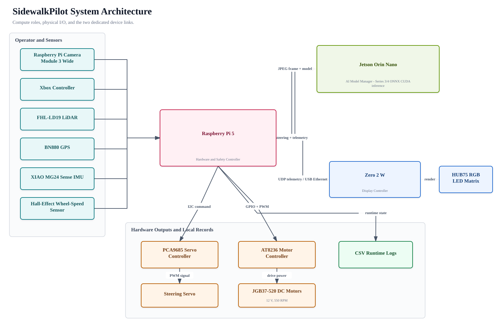
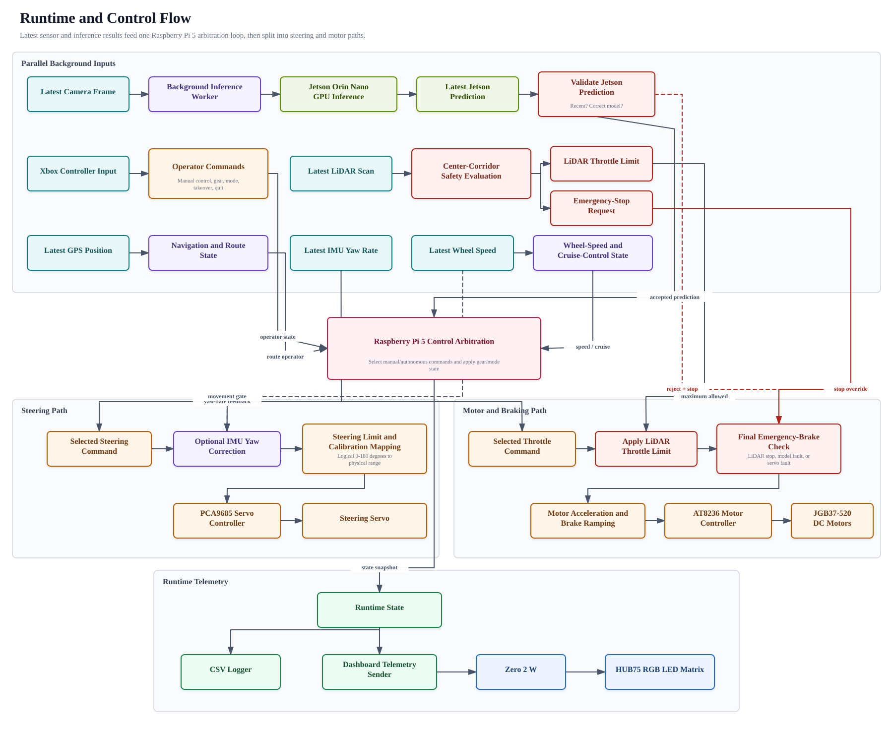
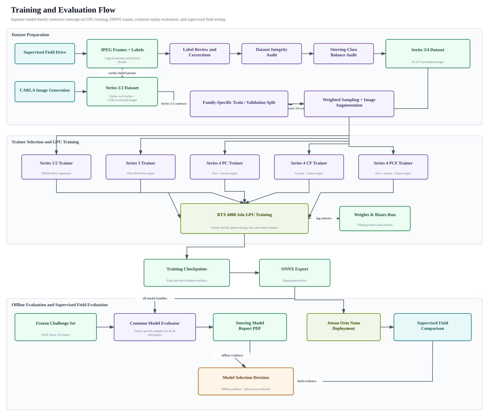
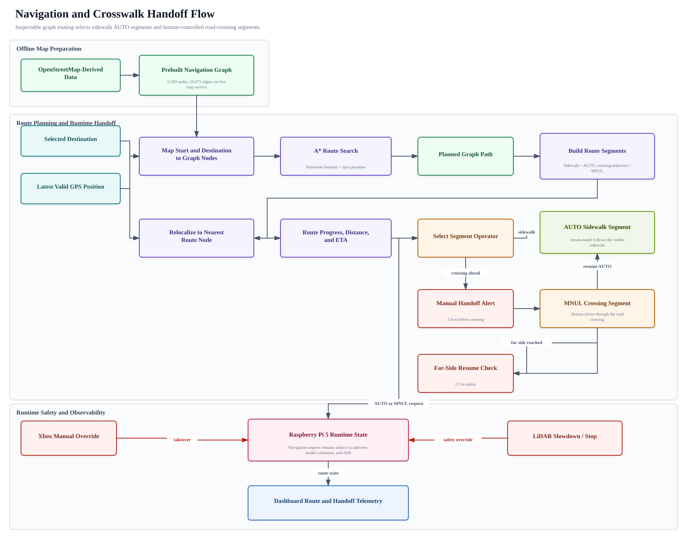

# System Diagrams

This page is the top-level block diagram of SidewalkPilot: the three-device compute split, sensors, steering/motor hardware, and links that carry data between them. It is the anchor exhibit that every other diagram on this branch drills into.

## What the Diagram Shows

SidewalkPilot runs across three boards, each doing the job it is best at:

- **Jetson Orin Nano at `10.42.0.2:8770` - the AI brain.** Runs every current steering-model family on the GPU: Series 1/2 through PyTorch CUDA and Series 3/4 through ONNX Runtime CUDA. The Raspberry Pi 5 sends a camera frame and model selection; the Jetson Orin Nano returns decoded steering plus model/runtime telemetry. Autonomous driving requires a recent result from this path.
- **Raspberry Pi 5 (`raspberrypi5`) — the hardware and safety controller.** Owns the live hardware I/O. It reads the Xbox controller over pygame, captures frames from the Raspberry Pi Camera Module 3 Wide through Picamera2, reads the LiDAR, GPS, and Hall-effect wheel-speed sensor over serial/GPIO, drives the steering servo through the PCA9685 Servo Controller, drives the JGB37-520 DC motors (12 V, 550 RPM) through the AT8236 Motor Controller, writes CSV logs, and sends dashboard telemetry. The main loop lives in `code/controller/current/rc_car_app/runtime.py` and ticks at up to 50 Hz (`clock.tick(CONTROL_LOOP_HZ)`).
- **Zero 2 W (`zero2w`) - the dashboard.** Receives telemetry over USB Ethernet and renders it on one HUB75 LED panel. Rendering code is `z2w_dashboard.py`.

## Links Between Devices

- **Raspberry Pi 5 <-> Jetson Orin Nano:** direct Ethernet request/response for the selected model. The exact returned contract depends on the model family; the Raspberry Pi 5 receives decoded steering and telemetry.
- **Raspberry Pi 5 <-> Zero 2 W:** USB Ethernet gadget. Raspberry Pi 5 is `192.168.10.1`, Zero 2 W is `192.168.10.2`, dashboard telemetry is UDP to `192.168.10.2:8765` at a `0.1 s` send interval (`HUB75_DASHBOARD_SEND_INTERVAL_SEC`). This is USB-only by decision; there is no Wi-Fi fallback. When the controller quits it tells the Zero 2 W to shut down (linked shutdown, `HUB75_DASHBOARD_IDLE_EXIT_SEC = 2.0`).
- **Telemetry out:** training runs report to Weights & Biases; every controller launch writes a local CSV; InfluxDB logging is optional and activates only when the Raspberry Pi 5 has a valid `~/.influxdb.json` configuration.

## Why This Split

The Jetson Orin Nano supplies the GPU inference that makes the current Series 3/4 self-driving
path practical near the camera rate. The Raspberry Pi Camera Module 3 Wide remains connected
to the Raspberry Pi 5 because the original 81,237-image model-training snapshot was captured through that
camera path. Final steering, motor, and AEB decisions remain on the Raspberry Pi 5.

## What This Exhibit Documents

The checked-in separation of responsibilities: AI and current autonomous steering inference
on the Jetson Orin Nano, hardware and safety control on the Raspberry Pi 5, and observability
on the Zero 2 W. It does not establish hard-real-time timing or fault tolerance for every link.

## System Architecture

*Compute, I/O, and device-link architecture. Open the [full-size SVG](../../assets/diagrams/system-architecture.svg) or the [editable draw.io source](../../assets/diagrams/system-architecture.drawio).*

Source anchors: `code/controller/current/rc_car_app/runtime.py`, `config.py`, `vision.py`, `jetson_inference_server.py`, `hub75_dashboard.py`, and `z2w_dashboard.py`.

## Runtime and Control Flow

*Runtime command and safety flow. Open the [full-size SVG](../../assets/diagrams/runtime-control.svg) or the [editable draw.io source](../../assets/diagrams/runtime-control.drawio).*

Manual input cancels autonomy when processed. A fresh model proposal is required for autonomous steering. Enabled/fresh LiDAR can reduce forward throttle or request emergency braking, but it does not steer.

## Training and Evaluation Flow

*Training, export, and model-selection flow. Open the [full-size SVG](../../assets/diagrams/training-evaluation.svg) or the [editable draw.io source](../../assets/diagrams/training-evaluation.drawio).*

## Navigation Flow

*Navigation and crosswalk handoff flow. Open the [full-size SVG](../../assets/diagrams/navigation-flow.svg) or the [editable draw.io source](../../assets/diagrams/navigation-flow.drawio).*

## Related Pages

- [Evidence Map](../../portfolio-evidence/reader-paths/evidence-map.md)
- [Reports and PDF](../../publishing/reports.md)
- [Evidence Tables](../tables/model-metrics-table.md)
