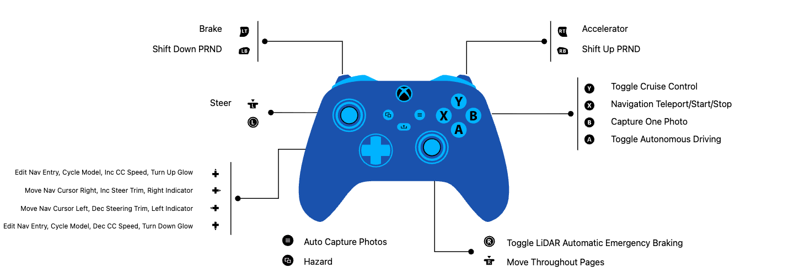

# Controller Mapping and Driving Modes

The car is driven and fully operated from an **Xbox Wireless Controller** over `pygame`.
This page is the human-readable reference for every button, trigger, stick, and D-pad action. The constants and event handling in `config.py` and `runtime.py` remain authoritative.

## How It Works

`runtime.py` reads `pygame` joystick events every loop (`pygame.event.get()`) and
dispatches axis, button, and hat (D-pad) events to driving, gearing, autonomy, photo
capture, navigation, turn signals, and dashboard paging. Every button and axis index is
a named constant in `config.py`, so the physical layout and the dispatch code stay in
sync. The values below are read straight from `config.py` and the event handler in
`run()`.

## Controller Map (Image)

## Sticks and Triggers

| Physical input | pygame axis | Constant | Action |
|---|---|---|---|
| Left stick X | `0` | `STEERING_AXIS` | Steering; deadzone `abs(v) < 0.10` snaps to center |
| Right stick Y | `3` | `DASHBOARD_PAGE_AXIS` | Dashboard: move page up/down (threshold `0.65`) |
| Right stick X | `2` | `DASHBOARD_PAGE_HORIZONTAL_AXIS` | Dashboard: move page column left or right (threshold `0.65`) |
| Right trigger | `4` | `THROTTLE_AXIS` | Throttle (normalized to `0..1`) |
| Left trigger | `5` | `BRAKE_AXIS` | Brake (`brake` engages above `0.1`) |

Qualifying manual steering, throttle, or brake input while autonomy is on calls the cancel
path when that input is processed by the Raspberry Pi 5 loop. A timed worst-case override latency has
not yet been measured.

## Buttons

Indices below are the `config.py` constants; the physical Xbox label is the mapping
observed on this controller.

| Physical button | pygame index | Constant | Action |
|---|---|---|---|
| A | `0` | `AUTONOMY_TOGGLE_BUTTON` | Toggle autonomous driving (forces gear D on) |
| B | `1` | `PHOTO_BUTTON` | Take a single photo (`take_photo`) |
| Menu | `11` | `AUTO_PHOTO_BUTTON` | Toggle continuous run capture at the configured 10 fps while moving |
| View | `10` | `HAZARD_BUTTON` | Toggle hazard lights |
| Y | `4` | `CRUISE_TOGGLE_BUTTONS` | Cruise-control toggle (only in gear D) |
| LB | `6` | `SHIFT_DOWN_BUTTON` | Shift down (P←R←N←D) |
| RB | `7` | `SHIFT_UP_BUTTON` | Shift up (P→R→N→D) |
| RSB (right stick click) | `14` | `AEB_TOGGLE_BUTTON` | Toggle Automatic Emergency Braking |
| X | `3` | `NAV_SELECT_BUTTON` | Jump to NAVIGATE page (page 5); advance/confirm entry; start or cancel a route |
| Share | `15` | `QUIT_BUTTON` | Quit (sets shutdown flag) |

## D-Pad (Hat)

| Input | Action |
|---|---|
| D-pad ←/→ | Left and right turn-indicator toggles; on the NAVIGATE page (5), it also moves the entry cursor |
| D-pad ↑/↓ | Context action: edit the navigation entry on page 5, cycle the steering model on page 2, or adjust cruise target speed or dashboard brightness elsewhere. Holding repeats after `DPAD_SCROLL_REPEAT_START_SEC` (0.6 s) at `DPAD_SCROLL_REPEAT_INTERVAL_SEC` (0.22 s) |

## Notes

- These are the indices as they exist in the code today. If `config.py` button constants
  change, this table is the place to re-verify against `run()`'s event handler.
- Physical labels (A/B/X/Y) reflect how this Xbox controller enumerates under pygame on
  the Raspberry Pi 5; the code keys off the numeric index, not the label.

## PRND Behavior

The gear state begins in Park and steps through `P`, `R`, `N`, and `D` with LB/RB. Park forces zero PWM and braking; Reverse applies negative motor PWM; Neutral coasts with zero PWM; Drive permits forward manual throttle, cruise, or autonomy. A shift cancels cruise. Enabling autonomy forces Drive. Forward AEB logic is intentionally skipped in Reverse so the driver can back away from a detected obstacle.

## Photo Capture

B queues one image. Menu toggles continuous capture at a configured 10 fps while the car is moving or commanded to move. A dated run directory receives timestamped JPEGs and a labels CSV containing logical steering (`0..180`) and absolute physical forward PWM (`0..1`). JPEG encoding and writing run outside the control loop. Finalization converts the CSV to the JSON format accepted by training.

The label is a software command sampled near the frame request, not measured wheel-angle or motor-torque feedback. Every run must be audited for decodable images, complete labels, and accidental stationary repetition before training.

## Related Pages

- [Runtime Loop](runtime-loop.md)
- [Runtime Configuration](config/servo-settings.md)
- [Dataset and Labels](../data/dataset-overview.md)
